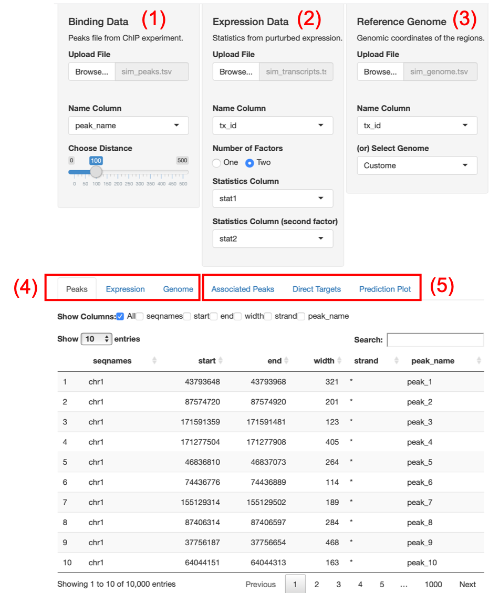

This tutorial assumes the reader is familiar with the target analysis
workflow. If not, the reader should start by reading the package vignette.

## The app interface

The app interface is divided into two parts for the inputs and the outputs.
Here, we explain the two parts of the interface and the different ways they can
be used.



### Input panels

The inputs required to perform the target analysis are managed by separate
panels. In addition, other required and optional parameters can be selected
form the related panels. The three input panels are

1. **Binding Data** to upload the peaks file from the ChIP experiment. The name
column and the desired distance from the regions of interest where peaks should
be included can be selected.

2. **Expression Data** to upload a file with the names of the regions of 
interest and the signed statistics from the perturbation experiment. The 
columns for the names and the statistics are then identified.

3. **Reference Genome** to upload or choose the appropriate reference genome.
The column with the names of the regions should also be identified.

Note: The name columns in **Expression Data** and **Reference Genome** should
contain the same IDs/names for the regions of interest.

### Output Tabs

The output tabs show the uploaded data and the output from the analysis.
The first three tabs show the files uploaded through the input panels where
they can be examined to make sure they contain the required fields.

4. The uploaded files
- **Peaks** is the uploaded binding data file
- **Expression** is the uploaded expression data file
- **Genome** is the uploaded/selected reference genome

5. The two outputs of the analysis are shown in the next two tabs

- **Associated Peaks** contain the peaks within the specified ranges, the 
calculated distances from the regions and their assigned region of interest.

- **Direct Targets** contain the regions of interest with their coordinates 
from the reference genome, the scores and the ranks based on their assigned 
peaks. 

The final output is a graphical presentation of the factor/s function

- **Prediction Plot** is the predicted function of the factor/s in the form of
the cumulative distribution function of the regulatory potential of the regions
divided in groups defined by the user.

## An example using simulated data

By default, the app loads with examples data and default parameters to perform
full target analysis of two competitive transcription factors. In this section,
we explain the required input data, the output and the analysis parameters.

- `sim_peaks.tsv`: This file contains the shared ChIP-Seq peaks of the two 
transcription factors. The file should contain at least five named columns
and only be in tab separated format (TSV) or standard bed format. Other columns
with additional information on the peaks (such as peak names) can be included.
This file is also shipped with the `target` packaged and can be accessed and
modified.

```r
peak_file <- system.file('target-app', 'sim_peaks.tsv', package = 'target')
readr::read_tsv(peak_file)
```

Two other inputs related to the peaks file are required. The first is the
column name of the peak names, `peak_name` in this case. The other is the
the distance from the transcription start site (TSS) in kilo base within which 
peaks should be considered, default is 100kb.

- `sim_transcripts.tsv`: This file contains the gene expression data from the
perturbation experiments and is also provided in TSV format. At least, three
columns are required; the region names and the signed statistics for each 
factor in a separate column. Each of the three columns names should be
specified in the Name columns and the statistics columns fields. This example
is set to predict the combined functions of two factors so the field number of 
factors should be selected as "Two". This file itself is similar available as

```r
trans_file <- system.file('target-app', 'sim_transcripts.tsv', package = 'target')
readr::read_tsv(trans_file)
```

- `sim_genome.tsv`: The last input file is the genome information in costume
format (TSV). This file should contain at least five columns (standard bed) and
a column with the regions names. This column should be specified in the name
column field and is used to merge the expression data to the corresponding
genomic regions.

```r
genome_file <- system.file('target-app', 'sim_genome.tsv', package = 'target')
readr::read_tsv(genome_file)
```

Alternatively, the genome can be specified by name in select genome. The 
available genomes are the mouse mm9 and mm10 and the human hg19 and hg38.

The output tabs Peaks, Expression and Genome are there to show visualize the 
input files and manually inspect them if needed.

Once the files are uploaded and the parameters chosen, the outputs are 
calculated and shown in the following three tabs

- Associated Peaks: This table includes all the peaks that were include 
(within the distance) in addition to three other columns:
  - assigned_region: the name of the region of interest to which the peak was
  assigned. 
  - distance: the distance in bp between the center of the peak and the TSS
  - peak_score: the regulatory potential of the peak based on the distance.

- Direct Targets: This table includes the merged genome and expression files
in addition to the five columns:
  - score: the sum of the regulator potential of all peaks in a given region.
  - score_rank: the rank of the region among all regions based on the 
  regulatory potential (score).
  - stat: the product of the singed statistics of the two factors.
  - stat_rank: the rank of the region among all regions based on the 
  statistics product (stat).
  - rank: the product of the two ranks

- Prediction Plot: The panel can be used to produce a graph of the final
predictions. The idea is to use the table 'Direct Targets' to divide the 
regions of interest into groups (for example based on the signed statistics),
and calculate the ECDF of the regulatory potential of each group separately.
The ECDF in this case represent the probability distribution of the regulatory
potentials in the groups. The group with the curves shifted upwards represent
the dominant function of the two factors combined.
