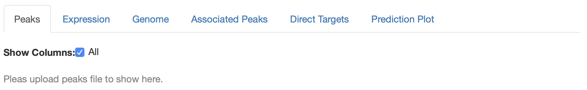

# Using the `target` App

The app interface is divided into two parts for the inputs and the outputs.
Here, we explain the two parts of the interface and the different ways they can
be used. This tutorial assumes the reader is familiar with the target analysis
workflow. If not, the reader should start by reading the package vignette.

## Input panels

The inputs required to perform the target analysis are managed by separate
panels. In addition, other required and optional parameters can be selected
form the related panels. The three input panels are

1. **Binding Data** to upload the peaks file from the ChIP experiment. The name
column and the desired distance from the regions of interest where peaks should
be included can be selected.

2. **Expression Data** to upload a file with the names of the regions of 
interest and the signed statistics from the perturbation experiment. The 
columns for the names and the statistics are then identified.

3. **Reference Genome** to upload or choose the appropriate reference genome.
The column with the names of the regions should also be identified.

Note: The name columns in **Expression Data** and **Reference Genome** should
contain the same IDs/names for the regions of interest.

## Output Tabs

The output tabs show the uploaded data and the output from the analysis.
The first three tabs show the files uploaded through the input panels where
they can be examined to make sure they contain the required fields.

1. **Peaks** is the uploaded binding data file
2. **Expression** is the uploaded expression data file
3. **Genome** is the uploaded/selected reference genome

The two outputs of the analysis are shown in the next two tabs

4. **Associated Peaks** contain the peaks within the specified ranges, the 
calculated distances from the regions and their assigned region of interest.

5. **Direct Targets** contain the regions of interest with their coordinates 
from the reference genome, the scores and the ranks based on their assigned 
peaks. 

The final output is a graphical presentation of the factor/s function

6. **Prediction Plot** is the predicted function of the factor/s in the form of
the cumulative distribution function of the regulatory potential of the regions
divided in groups defined by the user.

